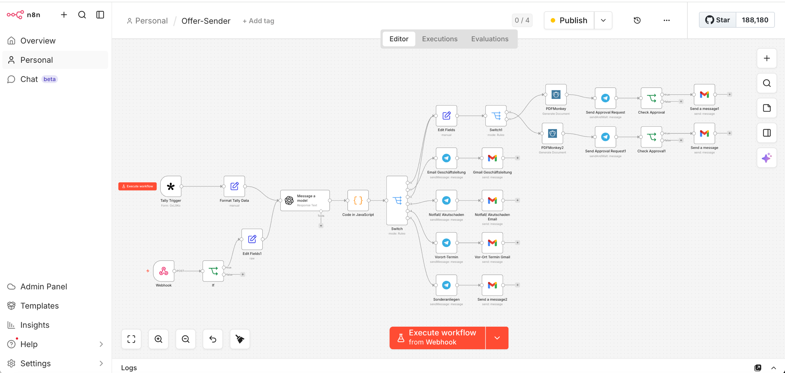

# Service Quote Generator

> Auto-generate customer quotes for service businesses with **GPT-4.1-mini classification**, **Telegram human-in-the-loop approval**, and **Gmail delivery**.

---

## What it does

A customer submits a quote request (via a Tally form or a webhook from a Voice-AI / phone bot). The workflow:

1. **Normalizes** the input into a canonical schema
2. **Classifies** the request type using GPT-4.1-mini (6 categories: single-family quote, multi-family quote, management inquiry, emergency, on-site appointment, special request)
3. **Routes** to the right branch
4. **Generates a PDF quote** via PDFMonkey (different template for single-family vs multi-family homes)
5. **Sends the draft to the business owner via Telegram** for approval — owner sees the PDF + key data and taps ✅ or ❌
6. **On approval, sends the final quote to the customer via Gmail**
7. **For non-quote categories**, fires Telegram + Gmail notifications to the right team member directly

## Live template

This workflow is also published on the n8n template marketplace:
👉 <https://n8n.io/workflows/15676-generate-service-quotes-with-gpt-41-mini-telegram-approval-and-gmail/>

## Use case

Built for **service-based small businesses** — cleaning services, contractors, plumbers, electricians, property managers — where:
- Many leads come in via form / phone
- Quotes need to be customized per request
- An owner / manager wants to review before the customer sees the price
- The team uses Telegram + Gmail as their daily tools

## Tech stack

| Component | Service |
|---|---|
| Form intake | [Tally](https://tally.so) |
| Alternative intake | n8n Webhook (HTTP) |
| AI classification | [OpenAI](https://openai.com) — model `gpt-4.1-mini` |
| Approval channel | [Telegram Bot API](https://core.telegram.org/bots) |
| PDF generation | [PDFMonkey](https://pdfmonkey.io) |
| Email delivery | Gmail (OAuth2) |
| Orchestration | [n8n](https://n8n.io) |

## Architecture

See [`architecture.md`](architecture.md) for the full mermaid flow diagram and node-by-node walkthrough.

## Setup

### Prerequisites

- An n8n instance (self-hosted, n8n Cloud, or n8n Desktop)
- Accounts at: OpenAI, Telegram (a bot via [@BotFather](https://t.me/BotFather)), Google (Gmail OAuth), PDFMonkey, Tally

### 1. Import

Generic instructions: [`../../docs/how-to-import.md`](../../docs/how-to-import.md).

### 2. Configure credentials

Click each red-bordered node and create credentials:

- **OpenAI** — `Classify Request with GPT-4.1-mini`
- **Telegram** — all `Telegram: …` nodes (uses the same bot)
- **Gmail** — all `Gmail: …` nodes (OAuth2)
- **PDFMonkey** — `Generate Quote PDF: …` nodes
- **Tally** — the trigger node (webhook URL is auto-generated)

### 3. Replace placeholders

Open each `Edit Fields` / `Set` node and update:
- `your-business-email@example.com` → your actual business email
- Telegram chat ID (in every Telegram node — where to send messages)
- PDFMonkey template IDs (one for EFH single-family, one for MFH multi-family)

### 4. Build your PDFMonkey templates

The workflow expects two PDFMonkey templates with the same variable names — see the `Edit Fields` nodes for the exact field list (`quadratmeter`, `kundenname`, `email`, `telefonnummer`, `reinigungsservice`, etc.).

### 5. Test

Submit a dummy request via your Tally form. Watch the Telegram chat for the approval prompt. Approve. Check your inbox for the test send.

### 6. Activate

Toggle **Active** in the top-right of the n8n canvas.

## Cost estimate (rough)

For a small business doing ~100 quote requests / month:

| Service | Estimated monthly cost |
|---|---|
| OpenAI (`gpt-4.1-mini`, ~500 tokens × 100 calls) | < $1 |
| PDFMonkey (100 PDFs on a starter plan) | ~$15 |
| Telegram | free |
| Gmail (with own Workspace) | $6+ (your existing Workspace cost) |
| Tally | free tier |
| n8n self-hosted | ~$5 (small VPS) |
| **Total** | **~$25 / month** |

Cost scales near-linearly with volume.

## Privacy & compliance

This workflow processes **customer personal data** (name, email, phone, address, service requirements). When you deploy it, you become responsible for GDPR / CCPA compliance:

- Tally form must include a privacy notice and consent checkbox
- OpenAI's API receives the request text — disclose this to customers
- PDFs are stored at PDFMonkey — review their data-retention settings

See [`../../docs/compliance-notice.md`](../../docs/compliance-notice.md) for the full notice.

## Screenshots

The screenshot above shows the full node graph in the n8n editor. From left to right:
**intake** (Tally trigger / Webhook) → **normalization** (Edit Fields) → **classification** (GPT-4.1-mini)
→ **branching** (Switch) → **PDF generation** (PDFMonkey) → **approval** (Telegram) → **delivery** (Gmail).

## Why this design?

See ["Why this design"](architecture.md#why-this-design) in `architecture.md`.

## Customizing for your business

- **More categories?** Add cases to the `Route by Request Category` switch + update the GPT prompt to recognize them.
- **Different approval channel?** Replace the Telegram `sendAndWait` with Slack or email approval.
- **Multi-language?** Pass the customer's language into the GPT prompt and the PDFMonkey template variables.
- **Multiple approvers?** Fan-out the Telegram node to multiple chat IDs.

## License

[MIT](../../LICENSE) — feel free to fork and adapt.
