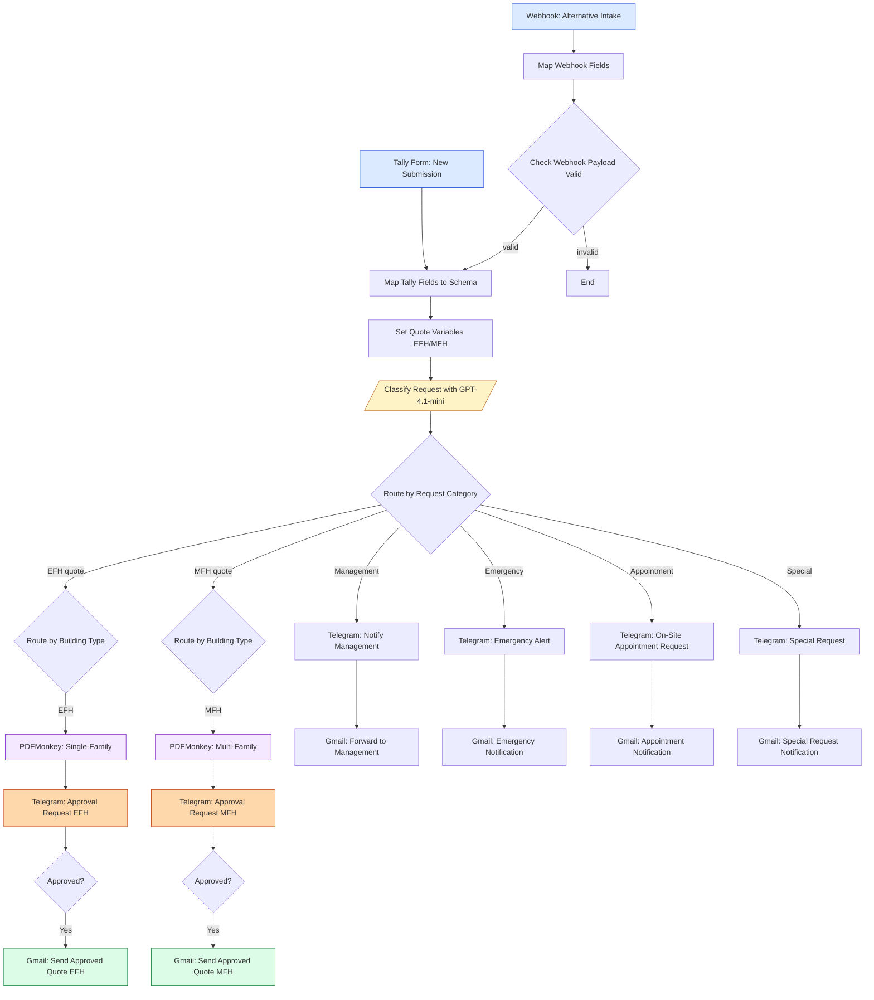

# Architecture — Service Quote Generator

## Flow diagram

## Why this design?

1. **Two intake channels** (Tally + Webhook) — Tally for human-friendly forms, Webhook for Voice-AI / phone-bot integrations. Both normalize into the same schema.
2. **AI classification before routing** — GPT-4.1-mini turns free-text customer requests into one of six categories (EFH quote, MFH quote, Management, Emergency, Appointment, Special). One classifier, six branches — cheaper and more flexible than per-channel rules.
3. **Human-in-the-loop via Telegram** — quote PDFs go to the business owner for approval *before* the customer ever sees them. Approval is a single tap in the chat (n8n's `sendAndWait` node).
4. **PDF templates per category** — single-family (EFH) vs multi-family (MFH) homes need different pricing logic and rendering, so they get separate PDFMonkey templates.
5. **Non-quote categories skip the PDF + approval loop** — emergencies and appointments are time-sensitive, so they fire Telegram + Gmail directly to the right person.

## Node-by-node walkthrough

| # | Node | Type | Purpose |
|---|---|---|---|
| 1 | Tally Trigger: New Form Submission | `tallyforms.tallyTrigger` | Webhook from Tally form |
| 2 | Webhook: Alternative Intake | `webhook` | HTTP endpoint for Voice-AI / phone bot |
| 3 | Map Tally Fields to Schema | `set` | Normalize Tally payload to canonical fields |
| 4 | Map Webhook Fields | `set` | Normalize webhook payload to same schema |
| 5 | Check Webhook Payload Valid | `if` | Reject malformed webhook requests |
| 6 | Set Quote Variables (EFH/MFH) | `set` | Pre-compute pricing inputs (sqm, services, etc.) |
| 7 | Classify Request with GPT-4.1-mini | `langchain.openAi` | One-shot classifier — assigns category enum |
| 8 | Route by Request Category | `switch` | Branches into 6 paths based on classifier output |
| 9 | Route by Building Type (EFH vs MFH) | `switch` | For quote requests only — picks PDF template |
| 10 | Generate Quote PDF: Single-Family Home | `pdfmonkey.pdfMonkey` | PDFMonkey template for EFH |
| 11 | Generate Quote PDF: Multi-Family Home | `pdfmonkey.pdfMonkey` | PDFMonkey template for MFH |
| 12 | Telegram: Approval Request EFH/MFH | `telegram` (sendAndWait) | Sends PDF to owner, blocks until ✅/❌ |
| 13 | If Approval Approved EFH/MFH | `if` | Branches on owner's answer |
| 14 | Gmail: Send Approved Quote EFH/MFH | `gmail` | Final delivery to customer |
| 15+ | Telegram + Gmail notification chains | `telegram` + `gmail` | Direct routing for non-quote categories |

## Configurable variables

When you import the workflow, these need to be replaced with your real values:

- Telegram chat ID (in every `Telegram` node)
- Business email (`your-business-email@example.com`)
- PDFMonkey template IDs (EFH + MFH)
- OpenAI model name (defaults to `gpt-4.1-mini`)
- Tally form ID (auto-set when you re-connect the Tally trigger)
